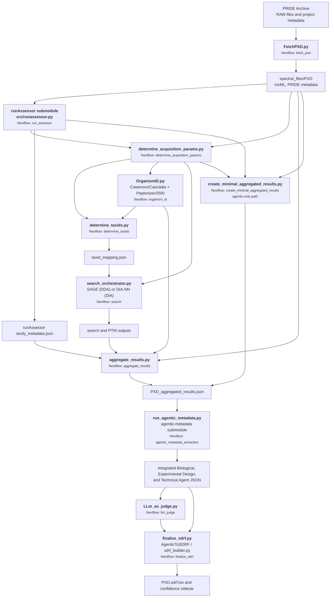
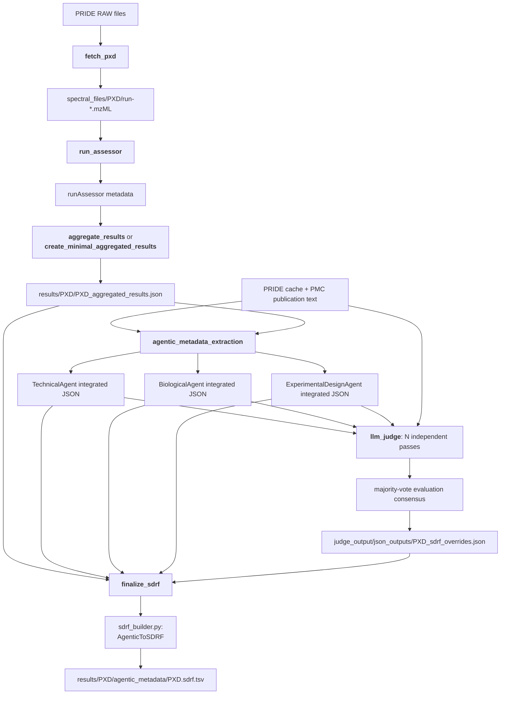

# HAMLET

**H**ybrid **A**gentic **M**etadata **L**iterature **E**xtraction and **T**echnical annotator

HAMLET is a local Nextflow DSL2 pipeline that processes PRIDE proteomics datasets end-to-end — from raw file download through database search — and produces a structured JSON report per experiment enriched with organism identity, instrument parameters, post-translational modifications, and optionally LLM- and agentic-extracted publication metadata.

## 1. Pipeline Structure and Installation

### Pipeline overview



### What HAMLET does

1. **Fetches** RAW files from PRIDE and converts them to mzML (via ThermoRawFileParser / ProteoWizard)
2. **Assesses** each run with runAssessor — detects acquisition type (DDA/DIA), labeling, instrument model, fragmentation
3. **Identifies organisms** via de novo peptide sequencing (Casanovo / CasanovoBolt) + Peptonizer2000 taxonomy scoring, with PRIDE project organism metadata used to augment the taxid search pool
4. **Routes searches** automatically — DDA via SAGE, DIA via DIA-NN (controlled by `--acquisition_type`)
5. **Extracts publication metadata** via optional LLM prompting (`--run_llm_extraction`) and manifest-controlled downstream agentic stages
6. **Aggregates** all per-PXD outputs into a single `*_aggregated_results.json` report
7. **Generates SDRF** — the agentic pipeline can produce SDRF-Proteomics v1.1.0 TSV files via `src/python/run_agentic_metadata.py`

The pipeline is **100% container-free**, using conda environments for all tools.

---

### Installation

### 1. Prerequisites

| Requirement | Notes |
|------------|-------|
| Linux (x86-64) | Tested on Ubuntu 22.04+ |
| [Nextflow](https://www.nextflow.io/docs/latest/install.html) ≥ 25.04 | `curl -s https://get.nextflow.io \| bash` |
| curl or wget | For Miniconda and file downloads |
| NVIDIA GPU | Optional — speeds up organism identification (Casanovo) |
| ~50 GB free disk | Per PXD (RAW files are 1–3 GB each) |

### 2. Clone and bootstrap

```bash
git clone <repo-url> HAMLET
cd HAMLET
bash src/setup.sh
```

`src/setup.sh` will:
- Install Miniconda if not already present (then ask you to re-run after `source ~/.bashrc`)
- Create four conda environments from [src/conda_envs/](src/conda_envs/):
  - `meti_env` — core tools: FetchPXD, SAGE, runAssessor, aggregation scripts
  - `search_env` — database search dependencies
  - `cascadia_env` — DIA peptide identification runtime (model weights + Lightning; uses `src/cascadiaBolt/` for inference)
  - `casanovo_env` — DDA de novo sequencing runtime (PyTorch + Lightning; uses `src/casanovoBolt/` for inference)
- Verify key executables (`ThermoRawFileParser`, `aria2c`, etc.)
- Download NCBI taxonomy database files (nodes.dmp, names.dmp) for organism identification

### 3. Download the NCBI taxonomy database (required for organism identification)

The pipeline uses NCBI taxonomy files for deduplication during organism identification. These are downloaded automatically by `src/setup.sh`, but you can also download them manually:

```bash
bash src/bash/download_ncbi_taxonomy.sh
```

This downloads and extracts:
- `nodes.dmp` (206 MB) — NCBI taxid hierarchy
- `names.dmp` (277 MB) — NCBI taxid to organism name mapping

These files are required for accurate species-level organism identification but will fall back gracefully if missing (using simple taxid counting).

### 4. Download the Cascadia model (required for DIA)

The Cascadia checkpoint (558 MB) is stored separately from the repo:

1. Download `cascadia.ckpt` from [Google Drive](https://drive.google.com/drive/folders/1UTrZIrCdUqYqscbqga_KdX8kc8ZjMMfr?usp=sharing)
2. Place it in the repo:
   ```bash
   mv ~/Downloads/cascadia.ckpt assets/
   ```

If you only process DDA datasets you can skip this step.

### 5. Set your API key (required for LLM/agentic features)

```bash
export OPENROUTER_API_KEY="sk-or-..."
```

HAMLET sends all LLM requests to OpenRouter. Add this to `~/.bashrc` to make it persistent. The pipeline reads it from the environment — **never put API keys in source files**.

### 6. Verify setup

```bash
conda activate meti_env
which ThermoRawFileParser && which aria2c
python -c "import pandas, sage_runner; print('OK')"
conda deactivate
```

---

## 2. Pipeline Usage Modes

### Single PXD

```bash
nextflow run main.nf --pxd PXD000070
```

### Single PXD — limit files (for quick testing)

```bash
nextflow run main.nf \
  --pxd PXD000070 \
  --max_raw_files 3 \
  -resume
```

### Globus download and runAssessor-only mode

Use `--globus` to transfer selected PRIDE RAW files from the EMBL-EBI Public Data collection. The Globus CLI must be authenticated, and Globus Connect Personal must expose `--central_mzml_dir` on the destination host.

Use `--runAssessorOnly` to stop after `fetch_pxd` and `run_assessor`; no acquisition detection, organism identification, search, aggregation, or agentic processes are launched.

```bash
nextflow run main.nf \
  -c assets/nextflow_configs/nextflow_JS2.config \
  --pxd PXD000070 \
  --globus \
  --runAssessorOnly \
  --max_raw_files 1 \
  -resume
```

### Batch from CSV

The CSV must have a `PXD` column:
```csv
PXD
PXD000070
PXD000312
PXD000534
```

```bash
nextflow run main.nf \
  --pxd_csv master.csv \
  --num_pxds 10 \
  --max_raw_files 5 \
  -resume
```

### Using pre-configured test datasets

Test PXD lists are available in [assets/pxd_test_files/](assets/pxd_test_files/) for validation and CI/CD:

| Dataset | Count | Purpose |
|---------|-------|---------|
| `ConsolidatedTestPXDs.csv` | 142 | Comprehensive test — all validated test PXDs |
| `GoldStandardSDRFs.csv` | 101 | Production validation — datasets with known-good SDRFs |
| `PXDsTest.csv` | 2 | Quick smoke test for CI/CD pipelines |
| `PXDsingle.csv` | 1 | Single-PXD debugging |

**Quick test with 2 PXDs (fast validation):**
```bash
nextflow run main.nf \
  --pxd_csv assets/pxd_test_files/PXDsTest.csv \
  --max_raw_files 3 \
  -resume
```

**Comprehensive test with 20 datasets:**
```bash
nextflow run main.nf \
  --pxd_csv assets/pxd_test_files/ConsolidatedTestPXDs.csv \
  --num_pxds 20 \
  --max_raw_files 5 \
  -resume
```

See [assets/pxd_test_files/README.md](assets/pxd_test_files/README.md) for detailed information about each test set.

### Manifest-driven stage control

HAMLET now uses `results/pipeline_stage_manifest.json` as the single source of truth for per-PXD stage execution.

- Deprecated run flags such as `--run_search`, `--run_agentic_metadata`, and `--run_llm_judge` are no longer used.
- On each run, HAMLET reconciles the manifest from existing outputs.
- runAssessor now runs in its own dedicated stage (`run_assessor`) between `fetch` and `determine_acquisition_params`, so it can be updated and rerun independently.
- Per stage, each PXD has:
  - `availability`: whether the stage is allowed to run
  - `complete`: computed from checkpoint files
  - `key_outputs`: checkpoint file patterns used to determine completion

### runAssessor as a submodule (recommended)

You can keep runAssessor decoupled from HAMLET by installing it as a git submodule and letting the dedicated `run_assessor` process call it.

```bash
git submodule add <RUNASSESSOR_REPO_URL> submodules/runassessor
git submodule update --init --recursive
```

Then run HAMLET normally. The pipeline will prefer:

- `--runassessor_script submodules/runassessor/src/runassessor.py`

and requires this submodule path to exist.

Default behavior for a normal run:

```bash
nextflow run main.nf --pxd_csv master.csv -resume
```

Force acquisition mode or provide fallback taxid:

```bash
nextflow run main.nf \
  --pxd PXD000070 \
  --acquisition_type DDA \
  --taxid 9606 \
  -resume
```

### Example: disable a stage for one PXD in the manifest

```bash
python - <<'PY'
import json
from pathlib import Path

mf = Path('results/pipeline_stage_manifest.json')
data = json.loads(mf.read_text())
data['pxds']['PXD000070']['stages']['llm_judge']['availability'] = False
mf.write_text(json.dumps(data, indent=2))
print('Updated manifest: disabled llm_judge for PXD000070')
PY
```

### With optional LLM extraction

```bash
export OPENROUTER_API_KEY="sk-or-..."

nextflow run main.nf \
  --pxd_csv master.csv \
  --run_llm_extraction true \
  -resume
```

---

### Standalone SDRF generation

After the pipeline produces `*_aggregated_results.json` outputs, you can generate SDRF-Proteomics v1.1.0 TSV files independently using the agentic metadata script.

**Run the agentic extraction + SDRF conversion for one PXD:**

```bash
python src/python/run_agentic_metadata.py \
  --input results/PXDxxxxxx/PXDxxxxxx_aggregated_results.json \
  --outdir store/agentic_results_files/PXDxxxxxx/ \
  --pride_cache pride_survey/pride_cache \
  --pmc_cache pride_survey/pmc_cache
```

Output: `store/agentic_results_files/PXDxxxxxx/sdrf.tsv`

**Batch run with parallelism (requires GNU parallel):**

```bash
parallel -j 10 < run_agentic_metadata.cmds
```

---

### PRIDE survey (`src/python/pride_survey.py`)

`pride_survey.py` is a standalone utility for surveying all public PRIDE projects, building a master dataset, and slicing it into analysis subsets. It runs in three explicit stages that can be invoked independently or combined.

### Stages

| Flag | Stage | Description |
|------|-------|-------------|
| `--update_caches` | 1 — Update caches | Fetches all PRIDE projects (paginated) and PMC full-text for each project that has a PubMed ID. Results are stored in `<outdir>/pride_cache` and `<outdir>/pmc_cache`. Already-cached entries are skipped. |
| `--build_master` | 2 — Build master.csv | Reads the caches and produces `master.csv` with one row per PRIDE project, including organism names, taxids, raw file count, experiment types, publication license, and reannotation status flags. |
| `--parse_subsets` | 3 — Parse subsets | Reads master.csv, writes analysis subset CSVs (e.g. LiP-MS projects), and runs LLM analysis on each subset using `<outdir>/llm_cache`. |

### Arguments

| Argument | Default | Description |
|----------|---------|-------------|
| `--update_caches` | off | Run Stage 1: fetch/refresh PRIDE and PMC caches |
| `--build_master` | off | Run Stage 2: build master.csv from caches |
| `--parse_subsets` | off | Run Stage 3: parse subsets and run LLM analysis |
| `--outdir` | `./pride_survey/` | Directory containing `pride_cache`, `pmc_cache`, `llm_cache`, and subset CSVs |
| `--master` | `./master.csv` | Path to write (Stage 2) or read (Stage 3) master.csv |
| `--prompt` | `assets/prompts/minimal_lipms.txt` | LLM prompt file used in Stage 3 |

### Columns in master.csv

| Column | Source | Description |
|--------|--------|-------------|
| `accession` | PRIDE | PXD accession |
| `pubmed_id` | PRIDE references | PubMed ID of the associated publication |
| `pmc_id` | PMC cache | PMC ID resolved from the PubMed ID |
| `raw_file_count` | PRIDE files | Number of `.raw` files in the project |
| `organism` | PRIDE organisms | Semicolon-separated organism names |
| `taxids` | PRIDE organisms | Semicolon-separated NCBI taxids (from `NEWT:XXXXX` accession codes) |
| `experiment_types` | PRIDE experimentTypes | Semicolon-separated experiment type names |
| `pub_license` | PMC full-text response | Open-access license (e.g. `CC BY`, `CC BY-NC-ND`) |
| `Reannotated` | — | Boolean flag for tracking reannotation status |
| `Reannotation_QC` | — | Boolean flag for tracking QC status |

### Usage examples

**Stage 1 only — refresh caches:**
```bash
python src/python/pride_survey.py --update_caches --outdir pride_survey/
```

**Stage 2 only — build master.csv from existing caches:**
```bash
python src/python/pride_survey.py \
  --build_master \
  --outdir pride_survey/ \
  --master master.csv
```

**All stages in one run:**
```bash
python src/python/pride_survey.py \
  --update_caches \
  --build_master \
  --parse_subsets \
  --outdir pride_survey/ \
  --master master.csv \
  --prompt assets/prompts/minimal_lipms.txt
```

**Using a separate output directory (e.g. for a dated survey run):**
```bash
python src/python/pride_survey.py \
  --build_master \
  --outdir pride_survey_06022026/ \
  --master pride_survey_06022026/master.csv
```

> **Note:** `pride_cache` (~hundreds of MB) and `pmc_cache` (~2.5 GB) are large binary JSON files stored in `--outdir`. Stage 1 is incremental — running `--update_caches` again will only fetch projects not already in `pmc_cache`.

---

### Parameters

### Input

| Parameter | Default | Description |
|-----------|---------|-------------|
| `--pxd` | — | Single PRIDE accession (mutually exclusive with `--pxd_csv`) |
| `--pxd_csv` | — | CSV file with a `PXD` column |
| `--num_pxds` | all | Limit how many PXDs to read from `--pxd_csv` |

### Download & conversion

| Parameter | Default | Description |
|-----------|---------|-------------|
| `--max_raw_files` | `30` | Max RAW files per PXD (`null` = all) |
| `--globus` | `false` | Transfer PRIDE RAW files using Globus instead of aria2c/wget |
| `--globus_source_collection` | EMBL-EBI Public Data | Source Globus collection UUID |
| `--globus_destination_collection` | local collection | Destination UUID; discovered with `globus endpoint local-id` when unset |
| `--globus_destination_base` | `central_mzml_dir` | Destination collection path corresponding to central storage |
| `--use_aria2c` | `true` | Parallel downloads via aria2c |
| `--aria2c_threads` | `16` | aria2c concurrency per download |
| `--download_timeout` | `4h` | Timeout for download + mzML conversion |
| `--max_parallel_pxds` | `10` | Max PXDs fetched at the same time |

### Output

| Parameter | Default | Description |
|-----------|---------|-------------|
| `--outdir` | `results` | Published results directory |
| `--central_mzml_dir` | `spectral_files` | Central store for converted mzML files |

### Acquisition routing

| Parameter | Default | Description |
|-----------|---------|-------------|
| `--acquisition_type` | `AUTO` | `AUTO`, `DDA`, or `DIA` |
| `--auto_detect` | `true` | Use runAssessor to detect acquisition type and labeling |

### Search

| Parameter | Default | Description |
|-----------|---------|-------------|
| `--taxid` | unset | Fallback taxid if organism detection fails |
| `--sage_config` | `assets/default_sage.config` | SAGE search configuration |
| `--search_min_ptm_psms` | `50` | Min PSMs for a PTM to be included |
| `--search_max_variable_mods` | `3` | Max variable-mod residue types per search |
| `--high_confidence_q_threshold` | `0.01` | spectrum_q threshold for high-confidence PSMs |
| `--min_high_confidence_peptides` | `10` | Min high-confidence PSMs before running PTM-Shepherd |

### Organism identification

| Parameter | Default | Description |
|-----------|---------|-------------|
| `--denovo_threshold` | `70` | Min Casanovo/CasanovoBolt peptide confidence |
| `--min_peptides_for_peptonizer` | `5` | Min peptides required to run Peptonizer2000 |
| `--contaminants_fasta` | `assets/UniversalContaminats.fasta` | Contaminant sequences |
| `--taxid_list_file` | `assets/taxid_lists/CommonPRIDEtaxids.txt` | Allowed taxid list |
| `--organism_id_all` | `false` | Run organism identification on all files even when one representative file would suffice |
| `--num_gpus` | `2` | Number of GPUs for de novo sequencing (controls `maxForks` + `CUDA_VISIBLE_DEVICES` assignment; set to `0` or `1` for single-GPU systems) |

### Metadata extraction

| Parameter | Default | Description |
|-----------|---------|-------------|
| `--run_llm_extraction` | `false` | LLM-based metadata extraction from publications |
| `--n_judge_runs` | `3` | Number of LLM judge runs for consensus |
| `--stage_manifest` | `results/pipeline_stage_manifest.json` | Per-PXD stage availability/completion manifest |
| `--pride_database_path` | `/THISPATHDOESNOTEXIST` | Path to local PRIDE publication text database |
| `--llm_prompt_file` | `src/BaselinePrompt.txt` | Prompt template for LLM extraction |
| `--llm_workers` | `1` | Parallel LLM API calls per PXD |

### runAssessor stage

| Parameter | Default | Description |
|-----------|---------|-------------|
| `--runAssessorOnly` | `false` | Run only `fetch_pxd` and `run_assessor`, then stop |
| `--runassessor_submodule_dir` | `submodules/runassessor` | Preferred runAssessor submodule directory |
| `--runassessor_script` | `submodules/runassessor/src/runassessor.py` | Script used by dedicated `run_assessor` stage |

### Tool paths

| Parameter | Default | Description |
|-----------|---------|-------------|
| `--conda_base` | `~/miniconda3` | Conda installation prefix |
| `--cascadia_model_path` | `assets/cascadia.ckpt` | Cascadia DIA model checkpoint |
| `--peptonizer2000_host_path` | `src/Peptonizer2000` | Peptonizer2000 source directory |

---

## 3. Store and Per-PXD Contents

### Runtime output layout

Converted spectra have one canonical location under `--central_mzml_dir` (default: `spectral_files`). A downloaded RAW file is deleted only after its same-stem mzML file passes validation. The full pipeline and `--runAssessorOnly` both use this same storage policy.

```text
spectral_files/
└── PXDxxxxxx/
  ├── run-01.mzML                         # Canonical spectrum file
  ├── PXDxxxxxx_PRIDEmetadata.json
  ├── pmc_json/
  └── runAssessor/
    └── study_metadata.json
```

Spectral directories are not copied into `--outdir`. Each processed PXD publishes derived results only:

```
results/
└── PXDxxxxxx/
    ├── organism_results/                    # Casanovo + Peptonizer2000 outputs
    ├── search/                              # SAGE or DIA-NN search results
    ├── llm_results/                         # LLM-extracted metadata (if enabled)
    ├── agentic_metadata/                    # Agentic enrichment outputs (if enabled)
    ├── taxid_mapping.json
    ├── taxid_warnings.json
    └── PXDxxxxxx_aggregated_results.json    # ← main output
```

The `*_aggregated_results.json` is the primary deliverable: a single document with runAssessor data, organism identification, search results, PTM fractions, PRIDE metadata, and optionally LLM/agentic enrichments.

### Agentic metadata, judge, and SDRF flow

The final SDRF is generated from the per-PXD runtime outputs under `results/`; `store/` is an archival layout and is not an input to this workflow. The builder combines the aggregated results JSON with all three integrated agent JSONs. It does not use a raw agent response directly.



By default, **`llm_judge`** makes three independent evaluations (`--n_judge_runs 3`) against publication text and the integrated agent values. It majority-votes each field/value evaluation and writes both a consensus review and `judge_output/json_outputs/<PXD>_sdrf_overrides.json`.

**`finalize_sdrf`** reads that override document, accepts only an unambiguous selected value from the safe-field allowlist, and passes the resulting `{builder_field: value}` dictionary to `AgenticToSDRF`. The override applies in memory during TSV construction; it never mutates the three integrated JSONs. Each override artifact also retains judge verdict, correctness/completeness, hallucination/type-mismatch flags, and any corrected value for future provenance or confidence reporting.

The current safe override fields are organism/sample attributes, instrument, label, replicate and fraction identifiers, and experimental factor value. Technical fields derived directly from runAssessor or search output, including acquisition method, dissociation, mass tolerance, and modification parameters, are not currently judge-overridable.

---

### Store coverage as of 2026-08-18

The three primary directories under [`store/`](store/) are packaged pipeline outputs. Full file layouts, stage coverage, and the JSON schema reference are in [`store/README.md`](store/README.md).

| Directory | PXD count | Contents |
|---|---:|---|
| [`store/aggregated_results_files/`](store/aggregated_results_files/) | 2,756 | One aggregated pipeline-results JSON per PXD |
| [`store/agentic_results_files/`](store/agentic_results_files/) | 1,820 | Per-PXD BiologicalAgent, ExperimentalDesignAgent, and TechnicalAgent outputs |
| [`store/hamlet_sdrfs/`](store/hamlet_sdrfs/) | 306 | Curated SDRF-Proteomics TSV files |

### `store/aggregated_results_files/` version summary

| Category | Count | Meaning |
|---|---:|---|
| Full pipeline (`run_mode: full`) | **2,647** | Fetch, runAssessor, organism identification, search, aggregation, and PRIDE metadata completed |
| Agentic-only (`run_mode: agentic_only`) | **109** | Single-commit agentic-only records; no richer full-pipeline record exists in git history |
| Historical downgrades restored | **9** | Included in the 2,647 full-pipeline records above after restoration from git history |

The restored PXDs are `PXD002080`, `PXD003209`, `PXD004143`, `PXD005463`, `PXD009602`, `PXD012307`, `PXD012986`, `PXD014528`, and `PXD021874`. The richest recovered records were `PXD003209`, `PXD004143`, and `PXD005463`; they retain PTM open-search and modification-site-fraction results, and the first two also retain LLM metadata.

---

## 4. Further Documentation

Start with [store/README.md](store/README.md) for the complete store schema, version/run-mode distinctions, and coverage tables. The following documents cover the most common operating and development paths:

| Topic | Documentation |
|---|---|
| Agentic-only execution | [docs/AGENTIC_ONLY_WORKFLOW.md](docs/AGENTIC_ONLY_WORKFLOW.md), [docs/RUNNING_SINGLE_PXD_AGENTIC.md](docs/RUNNING_SINGLE_PXD_AGENTIC.md) |
| Store schema and output validation | [store/README.md](store/README.md), [docs/guides/AGGREGATED_RESULTS_SCHEMA.md](docs/guides/AGGREGATED_RESULTS_SCHEMA.md), [docs/guides/PIPELINE_VERIFICATION.md](docs/guides/PIPELINE_VERIFICATION.md) |
| Pipeline architecture | [docs/architecture/IMPLEMENTATION_NOTES.md](docs/architecture/IMPLEMENTATION_NOTES.md), [docs/architecture/TAXID_DETERMINATION.md](docs/architecture/TAXID_DETERMINATION.md), [docs/ARCHITECTURE_PER_FILE_CLOSED_SEARCH.md](docs/ARCHITECTURE_PER_FILE_CLOSED_SEARCH.md) |
| Storage and operations | [docs/CENTRALIZED_MZML_STORAGE_PLAN.md](docs/CENTRALIZED_MZML_STORAGE_PLAN.md), [docs/guides/PARALLEL_EXECUTION.md](docs/guides/PARALLEL_EXECUTION.md), [docs/guides/AUTO_DETECTION_FEATURE.md](docs/guides/AUTO_DETECTION_FEATURE.md) |
| SDRF roadmap | [docs/SDRF_PLAN.md](docs/SDRF_PLAN.md), [docs/plans/LLM_JUDGE_SDRF_INTEGRATION_PLAN.md](docs/plans/LLM_JUDGE_SDRF_INTEGRATION_PLAN.md) |

### Caching and resume

`resume = true` is set globally in [nextflow.config](nextflow.config). Nextflow caches completed tasks in `work/` — keep this directory to avoid re-running expensive steps. You can also pass `-resume` explicitly on the command line.

---

### Repository structure

```
main.nf                      # Pipeline entrypoint
nextflow.config              # All parameters and process resources
master.csv                   # Full PRIDE survey master dataset
subset.csv                   # Analysis subset of master.csv
src/
  setup.sh                   # Environment bootstrap
  BaselinePrompt.txt         # LLM prompt template for baseline metadata extraction
  conda_envs/                # Environment YAML definitions
  casanovoBolt/              # Optimized Casanovo fork (BF16, larger batches for RTX Ada)
  cascadiaBolt/              # Optimized Cascadia fork (BF16, larger batches for RTX Ada)
  python/
    OrganismID.py            # Organism identification orchestrator (de novo + Peptonizer)
    run_agentic_metadata.py  # Standalone agentic extraction + SDRF script
    sdrf_builder.py          # AgenticToSDRF class (SDRF-Proteomics v1.1.0)
    conflictAssessment.py    # SDRF field-level conflict assessment vs PRIDE/user SDRFs
    pride_survey.py          # PRIDE Archive survey and master.csv builder
  agentic-metadata/          # Multi-agent metadata extraction system
  analysis/
    plot_style.py            # Shared matplotlib style helpers for figures
    Figure1/  Figure3/  Figure4/
  bash/
    EXAMPLE.sh               # Annotated pipeline invocation examples
    run_single_pxd_test.sh   # Single-PXD test harness
    download_ncbi_taxonomy.sh
    install_search_tools.sh
  command_lists/             # Batch command files for parallel execution
    conflict_assessment.cmds # conflictAssessment.py batch run over gold-standard PXDs
    run_agentic_metadata.cmds
assets/
  cascadia.ckpt              # Cascadia model (download separately)
  default_sage.config        # Default SAGE search parameters
  UniversalContaminats.fasta # Contaminant sequences
  taxid_lists/               # Allowed organism taxid lists
  pxd_lists/                 # PXD accession lists (batch inputs, test sets, tracking)
  nextflow_configs/          # Site-specific Nextflow config overrides (JS2, CyVerse)
  gold_standard_sdrfs/       # Curated reference SDRFs for conflict assessment
  pxd_test_files/            # Test PXD sets for CI/CD validation
docs/
  PLOT_STYLE_GUIDE.md        # Figure style conventions
  architecture/              # Architecture diagrams and design notes
  guides/                    # How-to guides for pipeline operation
store/                       # Aggregated results, SDRFs, and agentic outputs (see store/README.md)
```

---

### Troubleshooting

**`command not found: conda`** — Run `source ~/.bashrc` (or `source ~/miniconda3/etc/profile.d/conda.sh`) then retry.

**GPU not utilized / wrong GPU assigned** — The local Nextflow executor does not support the `accelerator` directive. GPU assignment is done via `CUDA_VISIBLE_DEVICES` inside each `organism_id` task using `--num_gpus` (default `2`). If you have a different number of GPUs, override with `--num_gpus <N>` on the command line.

**`ThermoRawFileParser not found`** — The `meti_env` conda environment is not activated. Run `conda activate meti_env`.

**Exit code 42 on `fetch_pxd`** — The PXD contains no usable RAW files (e.g. DIA-NN output only). This is expected and the PXD is skipped automatically.

**Out of memory during search** — Reduce `memory` for the `search` process in [nextflow.config](nextflow.config):
```groovy
withName: search {
    memory = '50 GB'
}
```

**Organism identification times out** — The `organism_id` process has `errorStrategy = 'ignore'`; the pipeline continues without it and falls back to PRIDE metadata for taxid assignment.

**`parallel: command not found`** — Install GNU parallel: `sudo apt install parallel` or `conda install -c conda-forge parallel`.

---

### License

MIT License — see [LICENSE](LICENSE).
