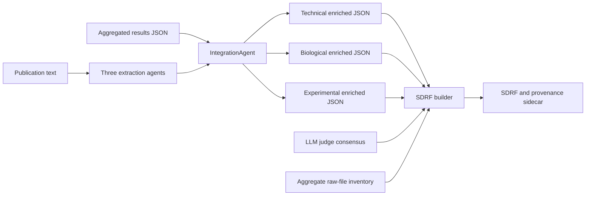

# Agentic Metadata to SDRF Integration Plan

Date: 2026-09-11

Status: Draft for joint refinement

Scope: Move all non-judge metadata integration from HAMLET SDRF finalization into the `HAMLETintegration` branch of the `agentic-metadata` submodule. This is a deliberate breaking update; preserving the old enriched-output schema is not a goal.

## 1. Decision

The SDRF builder must consume only:

1. the three enriched JSONs produced by `agentic-metadata`:
   - `TechnicalAgent/..._enriched.json`
   - `BiologicalAgent/..._enriched.json`
   - `ExperimentalDesignAgent/..._enriched.json`
2. the machine-readable `llm_judge` consensus/override output.
3. a raw-file manifest from `PXD*_aggregated_results.json`, used to decide which per-RAW metadata records IntegrationAgent must produce and which SDRF rows to create.

The builder must not re-read aggregate metadata to select instruments, acquisition mode, labels, dissociation, mass analyzers, PTMs, PRIDE descriptors, runAssessor fields, search tolerances, sample facts, or LLM-derived per-file values. It must not parse protocol prose or infer metadata semantics.

The aggregate JSON remains the integration input to `agentic-metadata`, not a second metadata source for the builder.

## 2. Answer to the Remaining-Input Question

After the submodule output contract below is implemented, raw-file names are the only information that the final builder needs directly from `PXD*_aggregated_results.json`.

This is viable only if integration exports every other source-backed value currently recovered downstream:

| Current aggregate-only read in HAMLET | Required location after migration | Why it is needed |
| --- | --- | --- |
| Per-file runAssessor instrument, accession, acquisition, dissociation, label, direct MS2 analyzer | TechnicalAgent enriched JSON, keyed by raw-file stem | Assay-level SDRF comments must not be broadcast from a representative run. |
| PRIDE `identifiedPTMStrings` and its explicit no-PTMs declaration | TechnicalAgent enriched JSON as study-scoped modification evidence | Preserve source structure and prevent `PRIDE:0000398` from becoming a modification. |
| PTM-Shepherd closed-search records | TechnicalAgent enriched JSON, keyed by raw-file stem | Modification applicability, targets, accessions, and fractions can differ by file. |
| runAssessor search tolerances | TechnicalAgent enriched JSON as study-scoped structured evidence | These are preferred direct machine results for precursor and fragment tolerances. |
| PRIDE organism, organism part, disease, and sample attributes | BiologicalAgent enriched JSON | The builder needs source-backed sample facts without reopening PRIDE data. |
| Per-file existing HAMLET LLM metadata such as treatment/enrichment | The owning enriched JSON, keyed by raw-file stem | Omit when unavailable; do not silently recover it in the builder. |
| PXD accession and integration provenance | `_enrichment` metadata in each enriched JSON | Needed for stable identifiers and auditability, not the aggregate JSON. |

Raw-file enumeration should remain intentionally narrow in the final builder. The manifest is not evidence for a metadata value and must not be used to derive replicate numbers, fraction identifiers, labels, channels, sample groups, or assay-level biological facts. Where no authoritative raw-file mapping exists, the renderer emits `not available` rather than constructing one. The known PXD068894 row-structure limitation remains out of scope.

The upstream integration stage has a broader, legitimate use of the manifest: it supplies the complete list of expected raw-file keys to the agents and forces them to emit one scoped result for each file. The manifest controls output shape, never the truth of a field value.

## 3. Current Failure Mode

HAMLET invokes the legacy `agentic-metadata/main.py all --integrate` path. It creates three enriched JSONs independently, then `finalize_sdrf.py` gives those files plus the aggregate JSON to `AgenticToSDRF`.

The builder currently compensates for incomplete integration by reopening the aggregate JSON and reconstructing source evidence. This duplicates resolution policy across two repositories and has produced repeated edge-case patches.

The current submodule integration also contains policies incompatible with the desired contract:

1. It selects the first runAssessor file as a study representative for fragmentation and spectra statistics.
2. It aggregates PTM-Shepherd records across sample files and discards file applicability.
3. It infers mass analyzer from an instrument name or fragmentation prefix.
4. It flattens multi-valued PRIDE values and generally retains only selected values rather than a complete, scoped candidate record.

## 4. Target Architecture



`IntegrationAgent` is the only component allowed to combine publication extraction, PRIDE submission metadata, runAssessor, PTM-Shepherd, search outputs, and existing HAMLET per-file metadata. It receives the complete aggregate JSON, preserves the source records, and emits a rendering-ready contract.

`finalize_sdrf.py` becomes an orchestration boundary: load the three enriched documents, load permitted judge decisions, obtain raw file names, and call the renderer. It performs no integration or source recovery.

The builder becomes a renderer: create deterministic rows from raw names, select values already resolved by IntegrationAgent or safely overridden by the judge, render controlled vocabulary syntax, and write the provenance sidecar.

## 5. Manifest-Conditioned Per-RAW Extraction

The three agent outputs should contain one result for every raw file in the PRIDE manifest. This is a worthwhile upgrade because many data sources and manuscripts do distinguish runs, conditions, and organisms. It is not enough to append raw names as a free-text list, as the present wrapper does. The model needs a structured, bounded manifest and must return a structured result keyed by the provided raw-file names.

### 5.1 Upstream input bundle

Before calling the three extraction agents, the HAMLET integration mode constructs an input bundle from the aggregate JSON:

```json
{
  "pxd_id": "PXD000651",
  "raw_file_manifest": [
    {"raw_file": "HV_map_A1.raw", "raw_stem": "HV_map_A1"}
  ],
  "per_raw_evidence": {
    "HV_map_A1": {
      "organism_predictions": [
        {"taxon_name": "Homo sapiens", "taxon_id": 9606, "score": 0.97, "source_path": "...peptonizer_result.csv"}
      ],
      "technical": {
        "instrument": {"name": "Orbitrap Velos Pro", "accession": "MS:1003096"},
        "acquisition": "DDA",
        "fragmentation": "LR IT CID"
      }
    }
  },
  "study_evidence": {
    "pride_project": {},
    "search_criteria": {}
  },
  "publication_text": "..."
}
```

The bundle is an integration/extraction input internal to `agentic-metadata`; it is not passed to the SDRF builder. Long tool output should remain structured data rather than being pasted wholesale into prompt prose.

### 5.2 Agent result shape

Each agent returns two explicitly distinct sections:

1. `study_fields`: facts supported at project/study/sample scope.
2. `per_raw_file`: a dictionary with exactly the supplied raw stems as keys. Each field carries `value`, `evidence`, `evidence_scope`, and an explicit state such as `supported`, `study_scope_only`, or `unknown`.

For example:

```json
{
  "per_raw_file": {
    "HV_map_A1": {
      "organism": {
        "value": "Homo sapiens",
        "state": "supported",
        "evidence": "per-file Peptonizer prediction supplied in the evidence bundle",
        "evidence_scope": "assay"
      },
      "tissue": {
        "value": null,
        "state": "study_scope_only",
        "evidence": "cerebrospinal fluid is described for the study but not linked to this file",
        "evidence_scope": "study"
      }
    }
  }
}
```

The later enriched result preserves these candidates alongside PRIDE, runAssessor, PTM-Shepherd, search, and manuscript evidence. An `unknown` per-file field must remain unknown; the model must not fill it by pattern-matching a filename.

### 5.3 Prompt rules

Add a common manifest-aware prompt section to all three agents:

1. Return one record for every manifest raw file and use the supplied raw stem exactly.
2. Use a per-file structured evidence item only for that file.
3. Use manuscript text for a raw file only when the text, a table, or a supplied mapping explicitly connects the value to that raw file or an unambiguous file group.
4. A study-level statement may be retained in `study_fields`, but must not become a `supported` per-file value merely because every file belongs to the PXD.
5. Never infer a biological or technical value from filename syntax.
6. When the supplied per-file organism candidates identify the organism, preserve that prediction and its score rather than replacing it with a model guess.
7. For each per-file value, state whether it is `supported`, `study_scope_only`, `conflicting`, or `unknown`.

This lets the LLM contribute where the manuscript genuinely maps run names to conditions, while leaving deterministic, source-backed assignments to IntegrationAgent.

### 5.4 Rendering policy for study-scope values

The remaining decision is when it is standards-appropriate to repeat a study-scoped value onto every SDRF row. The contract will preserve both scope and candidates either way. The preferred conservative default is:

1. Render `supported` per-file/assay evidence on the matching row.
2. For technical facts, do not rely on a study-wide broadcast: IntegrationAgent must export RunAssessor's per-RAW result for every manifest file. This includes detected `fragmentation_tag`/`fragmentation_type`, recommended precursor tolerance, recommended fragment tolerance, instrument, acquisition, label, and any direct MS2 analyzer.
3. A RunAssessor field that is unavailable or invalid for a particular raw file remains unavailable for that file. Do not substitute a first-file, project-level, or default value.
4. Do not broadcast study-scoped organism, organism part, disease, treatment, replicate, fraction, or factor values to each raw file without an authoritative mapping.
5. Render `not available` when the SDRF column requires a row-level value but available evidence has no valid applicability mapping.

This default should be confirmed before implementation because it controls the balance between complete-looking rows and strict source applicability.

## 6. Three-File Integration Contract

The three-file output shape remains, but their contents become richer and explicit. Every output document must include `schema_version: "hamlet-integration-v2"`, `pxd_id`, and `_enrichment` provenance.

### 6.1 Common evidence record

All source evidence uses one structured record shape:

```json
{
  "value": "LR IT CID",
  "cv_accession": null,
  "cv_name": null,
  "source": "runassessor",
  "scope": "assay",
  "raw_stem": "HV_map_A1",
  "source_path": "runAssessor.files.PXD000651/HV_map_A1.mzML.spectra_stats.fragmentation_tag",
  "source_value": "LR IT CID",
  "confidence": 1.0
}
```

Permitted scopes are `study`, `sample`, `assay`, and `file`. A missing or unknown value is not emitted as an evidence record.

### 6.2 Resolved field record

For a scalar field that can be selected without unsupported inference:

```json
{
  "resolved": "DDA",
  "status": "SOURCE_SELECTED",
  "confidence": 1.0,
  "scope": "assay",
  "resolution_rule": "direct_source_precedence:runassessor",
  "candidates": ["...common evidence records..."],
  "selected_source_index": 0
}
```

`resolved` may be `null`. In that case, the candidates still document why no value was selected. No value may be created by parsing an instrument name, fragmentation code, filename, broad project prose, or a related reagent.

### 6.3 TechnicalAgent enriched JSON

The TechnicalAgent file owns technical study evidence plus all raw-file-scoped technical integration:

```json
{
  "schema_version": "hamlet-integration-v2",
  "pxd_id": "PXD000651",
  "study_fields": {
    "cleavage_agent": {"resolved": "Trypsin/P", "candidates": []},
    "precursor_tolerance": {"resolved": "10 ppm", "candidates": []},
    "fragment_tolerance": {"resolved": "0.6 Da", "candidates": []},
    "reduction_reagent": {"resolved": null, "candidates": []}
  },
  "assay_fields": {
    "HV_map_A1": {
      "instrument": {"resolved": "Orbitrap Velos Pro", "candidates": []},
      "acquisition": {"resolved": "DDA", "candidates": []},
      "label": {"resolved": "label-free", "candidates": []},
      "dissociation": {"resolved": "LR IT CID", "candidates": []},
      "ms2_analyzer": {"resolved": null, "candidates": []},
      "modifications": ["...source-preserving modification records..."]
    }
  }
}
```

The precise top-level names can change during implementation, but the owner and meaning must not: the technical enriched JSON carries every per-file technical fact that the builder needs.

Modification records must preserve `name`, source-supplied accession, targets, fixed/variable state only if explicitly supplied, source, scope, source path, original value, raw stem, and PTM-Shepherd fraction when present. Integration may group source-equivalent records for rendering, but it must retain every source record.

Rules:

1. Exclude `PRIDE:0000398` from emitted modifications; preserve it only as an explicit no-PTMs statement in provenance if useful.
2. Filter missing target sentinels such as `nan`, `none`, and empty strings.
3. Do not infer UNIMOD accessions, target residues, termini, or fixed/variable status.
4. Do not infer MS2 analyzer. A direct `spectra_stats.ms2_analyzer` or explicitly extracted value may be emitted; otherwise it is unavailable.
5. Normalize safe formatting variants only for downstream CV rendering, for example `LR IT CID`, `LR_IT_CID`, and `lr-it-cid`. Preserve the original source value in evidence.
6. For each manifest raw file, export direct RunAssessor evidence under its raw stem:
  - `spectra_stats.fragmentation_tag` and/or `spectra_stats.fragmentation_type` as the detected fragmentation classification;
  - `summary.combined summary.recommended precursor tolerance (ppm)`;
  - `summary.combined summary.fragmentation tolerance.recommended fragment tolerance` plus its units;
  - any associated availability/quality indication and the exact source paths.
7. A positive, unit-bearing per-file recommendation is eligible for SDRF rendering. `N/A`, non-positive, missing, or quality-invalid values are preserved as unavailable evidence, never converted to a default tolerance.

### 6.4 BiologicalAgent enriched JSON

The biological enriched JSON owns study/sample fields and their candidates: organism, organism part, disease, cell type, cell line, sex, age, strain, material type, and related biological fields. It must carry PRIDE structured records and LLM evidence separately, including accession where supplied.

These fields stay study or sample scoped unless an authoritative raw-file mapping exists in the integration input. The renderer must not invent such a mapping.

### 6.5 ExperimentalDesignAgent enriched JSON

The experimental-design enriched JSON owns design fields and their evidence: factor values, biological/technical replicate information, fraction information, technology type, and sample counts.

Counts or descriptions at study scope do not imply a file-by-file assignment. The output must retain them as study evidence; the renderer emits `not available` for row-level replicate/fraction identifiers unless an authoritative mapping is supplied.

## 7. Organism Resolution Policy

### 7.1 Current behavior

The current `IntegrationAgent.resolve_field()` uses deterministic Python code, not an LLM prompt. It compares a single LLM value, a single tool value, and a single PRIDE value with case-insensitive equality, containment, and fuzzy matching.

When all three are present, it applies a two-out-of-three rule:

1. LLM and PRIDE agree: choose the LLM value and mark the tool as outvoted.
2. Tool and PRIDE agree: choose the tool value and mark the LLM as outvoted.
3. LLM and tool agree: choose the tool value and mark PRIDE as outvoted.
4. All three differ: choose the tool value.

When only LLM and tool are present and disagree, it also chooses the tool. This policy currently operates at study level, takes one top organism across all result files, and treats a project-level PRIDE organism as if it were an equally scoped vote. It is therefore unsuitable for per-RAW organism selection.

### 7.2 Required per-RAW policy

Replace the current organism rule in the HAMLET contract with a deterministic, scope-aware resolver. The LLM supplies manuscript evidence and does not choose the winning organism.

For each manifest raw file:

1. Normalize the corresponding Peptonizer result path to its raw stem and retain the ranked predictions, taxon IDs, scores, and source path.
2. Create the Peptonizer candidate set from every taxid whose score meets the configured minimum score. Do not require a gap between the first and second candidates.
3. Create the PRIDE candidate set from every supplied PRIDE organism taxid, even when those records are study scoped. Use a raw-file-specific PRIDE/sample association when one exists, but do not discard additional valid PRIDE taxa.
4. Create one LLM candidate set from every organism/taxid explicitly identified for that raw file. This includes all values in legacy `llm_extracted_metadata` and all values returned by manifest-aware BiologicalAgent extraction. A biological name may enter the set only after unambiguous taxonomy resolution to a taxid.
5. Count a taxid at most once within each source set. Peptonizer, PRIDE, and LLM are three sets: multiple candidates inside one set do not receive extra votes.
6. Select the unique taxid present in the most source sets. Preserve all candidates, their source sets, and their individual evidence/score records.
7. When sources disagree but a unique highest-count taxid exists, select it with `status: CONFLICTING_MAJORITY_SELECTED`. When the highest count is tied, emit `status: CONFLICTING_UNRESOLVED` and no selected organism rather than applying an arbitrary source preference.
8. When only one source set has an eligible candidate, it may be selected as `SOURCE_ONLY`; this is not a majority result. When no source set has an eligible candidate, emit `UNKNOWN`.
9. Preserve multi-organism candidates where the data are genuinely mixed; do not force one species solely to fill a cell.

The minimum Peptonizer score is a configuration value, for example `hamlet_integration.organism_min_score`. The repository currently uses `0.90` in one analysis script, but stored Peptonizer score distributions vary; do not adopt that number as a pipeline default without calibrating it against representative full-run aggregates. Agentic-only projects with `organism_identification.status = skipped_agentic_only` must still produce valid `unknown`/study-scoped records rather than failing.

### 7.3 Multiple-organism LLM output

The current BiologicalAgent contract does not yet support this requirement. Its `species` field is a single two-element `[value, evidence]` list, and the legacy taxid reader currently takes only the first `Characteristics[OrganismTaxid]` value even if the source list contains more.

The manifest-aware BiologicalAgent update must replace this limitation for organism resolution. For every raw-file record, it emits an `organism_candidates` array, with one item per explicitly supported organism:

```json
{
  "taxon_name": "Homo sapiens",
  "taxon_id": "9606",
  "evidence": "...verbatim manuscript evidence...",
  "evidence_scope": "assay",
  "source": "llm_manuscript"
}
```

The prompt must direct the model to return all distinct supported organisms, not a semicolon-delimited scalar and not a guessed single species. A study-level organism belongs in `study_fields`; it enters a particular raw file's LLM source set only when the manuscript or evidence bundle explicitly associates it with that raw file or its defined group.

## 8. Prompt and Extraction Changes

The upstream integration change should be paired with a prompt update. The extraction prompt is responsible for finding manuscript-backed information; `IntegrationAgent` is responsible for selecting among the supplied structured sources without inventing values.

### 8.1 Technical fields to add or correct

Update both technical prompt paths so HAMLET does not drift between the legacy entry point and DocETL:

1. `src/agentic-metadata/core/prompts.py` is the prompt used by HAMLET's present `main.py` path.
2. `src/agentic-metadata/docetl_pipeline/pipeline_technical.yaml` must match the same field contract or be made to use a common prompt fragment.
3. `core/field_mappings.py` and the TechnicalAgent output schema must include the exact fields and canonical aliases.

Add explicit extraction fields:

- `precursor_tolerance`
- `fragment_tolerance`
- `mass_analyzer` only when directly stated in manuscript text
- `ptm` / modification declarations, preserving every explicitly stated searched modification

No additional agent is proposed. "Manifest-aware extraction" means extending the existing BiologicalAgent, TechnicalAgent, and ExperimentalDesignAgent prompts, schemas, and result structure so each returns `study_fields` plus `per_raw_file` records. The existing `llm_extracted_metadata` is a legacy evidence stream, not a fourth agent.

### 8.2 Precursor and fragment tolerance prompt protocol

The prompt must instruct the model to treat the two tolerances as distinct and to search in this order:

1. When structured runAssessor/search results are supplied to the integration stage, IntegrationAgent uses them as the preferred source. The LLM does not manufacture a competing tool value.
2. During manuscript extraction, search the Methods, database-search, and data-analysis sections for explicit precursor/MS1 and fragment/MS2/product-ion tolerance statements.
3. Extract a manuscript tolerance only when the text unambiguously associates it with precursor or fragment ions.
4. When both values are stated, return them in their corresponding fields. Do not copy one value into both fields.
5. When the association is ambiguous, return `unknown`; evidence must not convert ambiguity into a guess.

Prompt examples should include both common unit types (`ppm`, `Da`) and a paired example such as: `4.5 ppm precursor tolerance; 20 ppm fragment tolerance`.

Integration precedence for the final selected value is:

1. direct structured runAssessor/search tolerance with valid positive value;
2. explicit manuscript extraction with a field-specific evidence quote;
3. judge-approved correction when permitted;
4. unavailable.

The current builder-level protocol regex fallback is removed after the integrated technical JSON carries this contract.

### 8.3 Modification prompt protocol

Update TechnicalAgent prompting to make the modification policy explicit:

1. Search only the submitted proteomics workflow: Methods, database-search parameters, and directly linked sample-preparation/search descriptions.
2. List every modification explicitly named as searched, fixed, variable, or otherwise declared in the analysis.
3. Preserve the literal modification name and an explicitly stated target residue or terminus.
4. Preserve fixed/variable status only when explicitly stated.
5. Do not infer a modification from a reagent. Iodoacetamide, TCEP, DTT, and similar reagents do not by themselves establish a searched modification.
6. Do not infer UNIMOD/PSI-MOD IDs, residues, termini, or fixed/variable status from common practice.
7. Do not convert an explicit "no PTMs" statement into a modification record.
8. Return `unknown` for unsupported modifications rather than completing a familiar modification pattern.

This improves the LLM evidence stream but does not replace structured PRIDE/PTM-Shepherd integration. The integration layer merges these streams as records; it does not make the LLM a privileged source of invented modification semantics.

### 8.4 Mass analyzer policy

Remove the instruction in the DocETL prompt that says to infer mass analyzer from a primary instrument model. Remove the corresponding `_get_mass_analyzer` instrument/fragmentation inference in `IntegrationAgent` for the HAMLET contract.

Directly stated manuscript analyzer or direct runAssessor `ms2_analyzer` evidence remains valid. Otherwise, emit no analyzer value.

### 8.5 Raw-file group prompt protocol

A group is a set of manifest raw files prepared under the same conditions and experimental setup, such as control and treatment groups in a differential experiment. The LLM may assign metadata to every file in a group only when the evidence bundle or manuscript establishes a reproducible membership mapping.

Acceptable group evidence includes:

1. an explicit table or supplementary record associating raw file names with sample IDs, conditions, or groups;
2. a manuscript statement that names the member runs/files directly;
3. an unambiguous documented naming convention supplied as structured evidence, together with the matching manifest entries.

The prompt must require the model to return the supporting quote or structured mapping for each group assignment. Narrative statements such as "control and treatment samples were analyzed" are insufficient without a way to associate those groups with particular raw files. In that case, retain the group description at study scope and leave the raw-file assignment unavailable.

## 9. Ownership Boundaries

| Responsibility | Owner after migration |
| --- | --- |
| Read and combine aggregate, PRIDE, runAssessor, PTM-Shepherd, SAGE/search, existing per-file metadata, and agent outputs | `agentic-metadata` `IntegrationAgent` |
| Preserve scope, source path, original source value, CV accession, candidates, and deterministic selection rule | `IntegrationAgent` |
| Normalize safe spelling/separator variants without changing source evidence | `IntegrationAgent`, with documented per-field rules |
| Extract manuscript facts and evidence | Biological, Technical, and ExperimentalDesign prompts/agents |
| Evaluate claims and publish safe consensus corrections | Existing separate `llm_judge` process |
| Apply permitted judge corrections to already integrated fields | `finalize_sdrf.py` / renderer boundary |
| Create rows from raw names, render SDRF headers/CV syntax, write TSV and provenance sidecar | HAMLET SDRF builder |
| Parse protocol prose, reopen source aggregate fields, infer technical metadata, or resolve source precedence | No downstream HAMLET component |

`llm_judge` remains a separate Nextflow process. It consumes integrated outputs and retains independent cache, observability, and rerun behavior. It should not become a substitute integration layer.

## 10. Implementation Sequence

### Phase 1: Contract and fixtures

1. Create `feature/hamlet-harmonized-contract` from upstream `HAMLETintegration`.
4. Add small aggregate fixtures with at least two raw files that disagree in technical values, organism candidates, and modifications.
3. Include a manifest-to-Peptonizer-path fixture and an agentic-only fixture with no organism predictions.
4. Include per-file recommended RunAssessor precursor and fragment tolerances, detected fragmentation values, unavailable/invalid tolerance values, and source paths.
5. Write contract tests before migration code: manifest key completeness, per-file provenance, no first-file broadcast, no filename-derived values, no analyzer inference, explicit no-PTM behavior, target-sentinel filtering, per-file RunAssessor tolerance extraction, and tolerance precedence.

### Phase 2: Upstream integration implementation

1. Construct the structured manifest/evidence bundle and add manifest-aware result sections to all three agents.
2. Replace first-file aggregation in the HAMLET integration path with per-file collection keyed by raw stem.
3. Add the common evidence and resolved-field representation.
4. Export the technical, biological, and experimental scoped sections in their respective enriched JSONs.
5. Replace study-level organism majority voting with the per-RAW scope-aware resolver.
6. Remove HAMLET-path mass analyzer inference.
7. Add structured tolerance integration and source-preserving modification integration.
8. Update the legacy and DocETL technical prompts and their output schemas together.

### Phase 3: Parent cutover

1. Update `run_agentic_metadata.py` to require the new enriched contract.
2. Change `finalize_sdrf.py` to receive the three enriched documents, judge output, and a raw-file inventory only.
3. Remove `aggregated_json` from `AgenticToSDRF` and remove aggregate parsing, protocol parsing, source adapters, and source-resolution logic from the builder.
4. Retain only rendering and judge correction application in the builder/finalizer path.

### Phase 4: Validation and release

1. Run upstream contract tests and existing submodule tests.
2. Run the parent SDRF unit tests after replacing aggregate-dependent fixtures with enriched-contract fixtures.
3. Run agentic-only regeneration for the ten-PXD audit cohort into `update_results/`.
4. Compare rendered SDRFs and provenance sidecars against the current evidence-preserving results, expecting intentional differences only where legacy inference is removed.
5. Review all unavailable fields and every judge-applied correction.
6. Merge upstream work to `HAMLETintegration`, then intentionally update the parent Gitlink and commit that pointer update with parent-side contract changes.

## 11. Acceptance Criteria

The migration is complete only when all conditions hold:

1. `AgenticToSDRF` has no aggregate metadata parameter and does not open an aggregate JSON.
2. `finalize_sdrf.py` uses the aggregate only to enumerate raw file names, if it receives it at all.
3. Every final technical metadata value is traceable to a record in the TechnicalAgent enriched JSON.
4. Every final biological/design value is traceable to its owning enriched JSON.
5. The sidecar records selected source, candidates, scope, source path, source value, and judge decision where applicable.
6. No output depends on first-file selection or analyzer inference from instrument/fragmentation.
7. Tolerance fields prefer valid direct runAssessor/search values, otherwise explicit manuscript evidence, otherwise unavailable.
8. Modification values preserve source-backed identity and do not invent accessions, targets, termini, or fixed/variable state.
9. The builder can regenerate the SDRF after deleting the aggregate except for an independently supplied raw-file inventory.
10. The ten-PXD cohort completes with no finalization failure and no use of saved PRIDE SDRFs as reconstruction input.

## 12. Questions to Settle Together

These product-policy decisions should be answered before coding the per-RAW contract:

1. What numeric value should be the initial `organism_min_score` for Peptonizer candidates? It should be selected after calibrating the score distribution and expected precision/recall on a representative full-run cohort.
2. Which biological values are safe to broadcast when an explicit project statement says all submitted runs used the same material? The current conservative proposal is none unless the source itself provides a file/sample association.
3. Should the current HAMLET `llm_extracted_metadata` per-file data be retained as an LLM evidence set during a transition, or should the new manifest-aware BiologicalAgent output replace it immediately?

## 13. Non-Goals

This migration does not:

1. infer missing replicate, fraction, sample/channel, or assay mappings from filenames or project-level counts;
2. use existing PRIDE SDRFs as hidden reconstruction input;
3. preserve compatibility with the prior flattened enriched JSON schema;
4. move `llm_judge` inside agentic extraction;
5. make source-backed unknowns look complete merely to populate an SDRF cell.