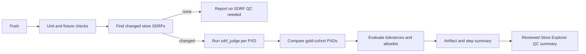

# HAMLET SDRF Gold-Cohort Quality Control Plan

Date: 2026-09-17

Status: The score-ranked 30-PXD v2.1.0 cohort was approved on 2026-09-17. Fixture and local QC-foundation implementation is in progress; CI and Store Explorer publication follow local validation.

Release storage uses immutable versioned artifacts as well as manifests. The active flat paths remain compatible with pipeline consumers, while `store/hamlet_sdrfs/v2.1.0/`, `store/hamlet_sdrfs/v2.1.1/`, `store/agentic_results_files/v2.1.0/`, and `store/agentic_results_files/v2.1.1/` retain the actual historical files. The v2.1.0 artifact snapshot is copied byte-for-byte from Git revision `18d4e458e8e3a4ebfa9e919e8bb0f35b145b3ff5`; no historical SDRF annotation is rewritten merely to match its snapshot directory name.

## 1. Decision

HAMLET quality control will use an immutable, reviewed set of high-quality HAMLET v2.1.0 SDRFs as the regression baseline. It will not use the current PRIDE SDRF as the blocking comparison target.

The baseline answers a narrow regression question: given a changed HAMLET SDRF, did the change degrade an already accepted HAMLET result for the same PXD? PRIDE SDRFs remain useful for source auditing and separate scientific comparison, but they are mutable external records and not the CI oracle.

The first production-scale validation of the QC system will be the reviewed promotion of the completed v2.1.1 cohort into the store. It must not be used to create the initial v2.1.0 baseline.

## 2. Scope and Non-Goals

### In scope

1. Select 30 reviewed v2.1.0 SDRFs from the current durable store.
2. Preserve their final SDRF, confidence sidecar, and final post-judge evidence as versioned fixtures.
3. Detect changed `store/hamlet_sdrfs/PXD*.sdrf.tsv` files in a push.
4. Run post-finalization SDRF judging directly on each changed stored SDRF.
5. Compare changed gold-cohort SDRFs to their immutable HAMLET baseline.
6. Publish QC results as a GitHub Actions artifact, GitHub step summary, and a reviewed Store Explorer data panel.

### Out of scope

1. Rerunning RAW fetch, RunAssessor, organism identification, or search in routine QC.
2. Treating a current PRIDE SDRF as immutable ground truth.
3. Automatically replacing gold fixtures after a passing or failing run.
4. Blocking on byte-for-byte equality of LLM judge output.

## 3. Baseline Cohort

The initial cohort is selected from the v2.1.0 records already present in:

```text
store/hamlet_sdrfs/PXD######.sdrf.tsv
store/agentic_results_files/PXD######/
store/aggregated_results_files/PXD######_aggregated_results.json
```

Each selected PXD must satisfy all of the following:

1. The final SDRF declares `HAMLET-agentic v2.1.0`.
2. A final post-judge report exists under `metadata_extraction_output/post_judge/`; pre-finalization `judge_output/` alone is insufficient.
3. The aggregate JSON exists and contains nonempty RunAssessor, organism-identification, and search/modification output. Historical aggregate records may predate the `run_mode` field or use a prior pipeline-version label; stage evidence, rather than those labels, determines eligibility.
4. It has a high final strict `judge_accuracy`, with no critical unresolved hallucination or type mismatch.
5. It contributes deliberate coverage across biological, technical, and experimental-design complexity. The cohort must not become a collection of only simple, high-scoring studies.

The selection report ranked all eligible candidates with their quality and aggregate-completeness evidence. The approved 30-PXD cohort and its known baseline caveats are recorded in `HAMLET_SDRF_GOLD_COHORT_CANDIDATES.md`.

### 3.1 Initial Store Survey

The initial 2026-09-17 survey found 490 stored SDRFs. Of these, 371 declare `HAMLET-agentic v2.1.0`; 308 have complete final post-judge metrics; and 287 satisfy the full artifact and aggregate-stage evidence requirements. The matching aggregate records use historical `pipeline_version: "1.0"` and do not contain `run_mode`, despite holding the required actual RunAssessor, organism, and search outputs.

The survey results and approved score-ranked cohort are recorded in `HAMLET_SDRF_GOLD_COHORT_CANDIDATES.md`. The approved cohort intentionally retains explicit critical-field modification, instrument, or acquisition-method caveats as baseline metadata. A strict exclusion for such issues would leave only 25 candidates, so it is retained as a diagnostic reference rather than replacing the approved cohort.

## 4. Immutable Fixture Contract

The approved fixtures live under a versioned path:

```text
tests/fixtures/sdrf_qc/v2.1.0/
  manifest.json
  qc_pxds.csv
  PXD######/
    PXD######.sdrf.tsv
    PXD######.confidence.sdrf.tsv
    post_judge/
      PXD######.json
      llm_judge_per_paper.csv
      llm_judge_annotation_review.csv
    baseline_metrics.json
```

`manifest.json` records the fixture version, PXD list, fixture-creation parent commit and `agentic-metadata` Gitlink, declared HAMLET version, judge provenance when available, fixture creation date, source paths, SHA-256 hashes, selection rationale, known baseline caveats, and accepted baseline metrics. The historical generation commit of an artifact is not invented when the durable store is ahead of its tracked file.

Fixtures are immutable by convention and code review. A later accepted improvement requires an intentional versioned baseline refresh with an explanation of every approved difference.

## 5. Routine QC Execution

Routine QC is post-store and runs only when a tracked SDRF has changed:

```bash
git diff --name-only "$BEFORE_SHA" "$GITHUB_SHA" -- store/hamlet_sdrfs \
  | grep -E '^store/hamlet_sdrfs/PXD[0-9]+\.sdrf\.tsv$'
```

If this produces no paths, the QC Action reports `No SDRF changes to evaluate` and exits successfully after ordinary unit and fixture-integrity tests.

For every changed PXD, invoke the existing single-SDRF pipeline mode directly:

```bash
python src/python/sdrf_judge.py \
  --pipeline \
  --pxd PXD###### \
  --sdrf store/hamlet_sdrfs/PXD######.sdrf.tsv \
  --pmc_cache <durable-pmc-cache> \
  --outdir qc-runs/<commit>/PXD######/post_judge \
  --workers 1
```

This produces a final judge JSON, per-paper and annotation-review CSVs, coverage CSV, and the three `llm_judge_*.png` plots without running Nextflow or rerunning metadata extraction.

This is intentionally post-store QC. A source-only change cannot be evaluated through this path until it produces a changed SDRF. Unit, contract, and renderer tests remain required before publishing generated results. Agentic-only cohort reruns remain a manual or scheduled release-validation tool for extraction/integration changes.

The implemented local report-only runner first validates every fixture hash, then discovers changed SDRFs from a Git range or accepts explicit PXDs. It compares only approved gold-cohort PXDs and records skipped judge work when a cache or API key is unavailable:

```bash
conda run -n meti_env python src/python/run_sdrf_qc.py \
  --before-sha <before-commit> \
  --after-sha <after-commit> \
  --commit <after-commit> \
  --output-dir qc-runs/<after-commit>
```

For a deterministic local comparator-only check, use `--pxd PXD###### --skip-judge`. `--strict` is reserved for a later blocking policy; ordinary runs remain report-only.

For the v2.1.1 release report, evaluate the 299 promoted PXDs against the immutable v2.1.0 release baseline:

```bash
conda run -n meti_env python src/python/run_sdrf_qc.py \
  --pxd-file assets/pxd_lists/HamletPXDs.csv \
  --pmc-cache pride_survey/pmc_cache \
  --commit <v2.1.1-release-commit> \
  --output-dir qc-runs/v2.1.1-full
```

This writes overall and category-level deltas for each PXD with available baseline and fresh post-store judge records. The category matrix is `PXD x {Biological, Technical, ExperimentalDesign} x judge metric`; `PXD035722` has no v2.1.0 judge baseline and is reported as such rather than receiving synthetic deltas. The run requires a nonempty `OPENROUTER_API_KEY` in the invoking environment and the durable PMC cache.

## 6. Candidate-versus-Gold Comparison

Extend `src/python/conflictAssessment.py` from its current store-versus-PRIDE entry point to accept explicit SDRF paths:

```bash
python src/python/conflictAssessment.py \
  --pxd PXD###### \
  --assessed-sdrf store/hamlet_sdrfs/PXD######.sdrf.tsv \
  --gold-sdrf tests/fixtures/sdrf_qc/v2.1.0/PXD######/PXD######.sdrf.tsv \
  --output-dir qc-runs/<commit>/PXD######/comparison
```

The generalized comparison is named `candidate_vs_hamlet_gold`. It preserves the existing normalized `comment[data file]` alignment and field-entity matching, then emits:

1. File coverage and missing or extra data files.
2. Added, removed, and changed headers and values.
3. Per-field and Biological, Technical, and ExperimentalDesign precision, recall, and F1.
4. An explicit, readable critical-field diff.
5. `conflict_summary.json`, detailed TSVs, and optional heatmaps.

Direct fixture comparison is deterministic. It answers whether a candidate differs from an accepted HAMLET result; it does not independently establish whether the new value is scientifically superior.

## 7. Two Independent Quality Signals

The Action must report these metrics separately:

| Signal | Question answered | Source |
| --- | --- | --- |
| Candidate versus HAMLET gold | Did an accepted SDRF change or lose coverage? | Direct normalized SDRF comparison |
| Fresh post-judge assessment | Is the resulting SDRF supported by publication and technical context? | `sdrf_judge.py --pipeline` |

The fresh judge is compared to the fixture's baseline judge metrics: `judge_accuracy`, correct/wrong/incomplete/hallucinated/type-mismatch counts, and critical-field verdicts. Because an external LLM can vary even at temperature zero, numeric judge scores use approved tolerances, while missing file coverage and unallowlisted critical-field changes remain hard failures.

## 8. Initial Gating Policy

Run in report-only mode until baseline stability has been measured over several repeat runs. The first blocking policy should require:

1. Every changed PXD emits a final SDRF and evaluable post-judge output.
2. Gold-cohort PXDs retain expected `comment[data file]` coverage.
3. No unallowlisted change or removal occurs in a critical field: organism/species, instrument, acquisition method, modification, precursor tolerance, or fragment tolerance.
4. No category or critical-field F1 decline beyond a reviewed tolerance, initially calibrated in the range $0.02$ to $0.03$.
5. No material increase in hallucinations or type mismatches, particularly for critical fields.

An explicit allowlist file is required for approved intentional changes; it records PXD, field, old value, new value, justification, approving commit, and expiry/review date.

## 9. GitHub Actions Architecture

The initial runner should be self-hosted because it has the Conda environment, durable PMC cache, and access to the `OPENROUTER_API_KEY` secret. Do not expose that secret to untrusted forks.

Workflow stages:



Use three operating tiers:

1. Every push: unit tests, fixture validation, and changed-SDRF detection.
2. Changed SDRFs: direct judge execution for each changed PXD; gold comparison when the PXD is in the cohort.
3. Major release/manual dispatch: full 30-PXD agentic-only rerun before store promotion. The reviewed v2.1.1 cohort is the first planned end-to-end validation of this tier.

The initial report-only implementation is `.github/workflows/sdrf-qc.yml`. It runs on a self-hosted runner for trusted pushes to `sdrf_builder_updates` and `qc-and-v2.1.1-updates`, validates the fixture manifest, evaluates changed SDRFs, and uploads `qc-runs/<commit>` as an artifact. It passes `OPENROUTER_API_KEY` only through GitHub Secrets and uses the optional `HAMLET_PMC_CACHE` repository variable. Without both, the report records post-judge evaluation as skipped rather than failing or exposing credentials.

## 10. Store Explorer Quality Control Panel

Add a separate panel to the existing Store Explorer Overview. It consumes a small, reviewed data file:

```text
docs/store-explorer/data/qc-summary.json
```

It reports baseline identity, latest accepted QC commit and status, changed SDRFs evaluated, gold-cohort pass/regression counts, judge-metric deltas, category-F1 deltas, critical-field regressions, and links to per-PXD plots and reports.

The Action uploads all candidate output as an artifact. `qc-summary.json` is only updated through a reviewed successful workflow, so the public Explorer never represents a transient run as accepted scientific output.

To publish a reviewed summary and its report files in an Explorer bundle, pass it explicitly while rebuilding the site:

```bash
python3 src/job_scripts/build_store_explorer.py \
  --pxd-file assets/pxd_lists/Hamlet_GS_pride_sdrf_union.csv \
  --qc-summary qc-runs/<accepted-commit>/qc-summary.json
```

The builder copies supported report files into `docs/store-explorer/data/qc/` and rewrites the summary with bundle-relative links. It never consumes or publishes a QC run unless `--qc-summary` is explicitly supplied.

The QC Overview uses an interactive grouped bar plot for all available judge metrics. A metric selector and relative/absolute change control overlay Biological, Technical, and ExperimentalDesign values by PXD; hover reveals the exact baseline, candidate, and both deltas.

## 11. Public Branch Consolidation

At planning time, `sdrf_builder_updates` is an ancestor of `feature/evidence-preserving-sdrf`. The active feature branch contains the Pages history plus the evidence-preserving commits, and no feature-only changes were found under `.github` or `docs/store-explorer`.

Before adding QC implementation, integrate the active feature branch into `sdrf_builder_updates` through a reviewed pull request or verified fast-forward. Continue Pages publication from `sdrf_builder_updates`, develop QC there after the integration, and close `feature/evidence-preserving-sdrf` only after the public deployment is confirmed.

## 12. Review Checkpoints

1. Approved: score-ranked v2.1.0 30-PXD cohort, retaining recorded caveats.
2. Generate and review fixture contents and baseline manifest.
3. Implemented: direct SDRF path support and deterministic comparison tests.
4. Run the Action in report-only mode.
5. Calibrate tolerances and critical-field allowlist format.
6. Validate v2.1.1 as the first large store-update QC exercise.
7. Enable blocking gates and publish the reviewed QC panel.